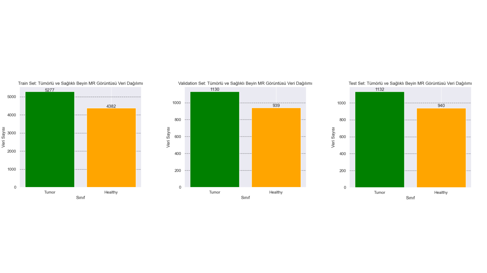
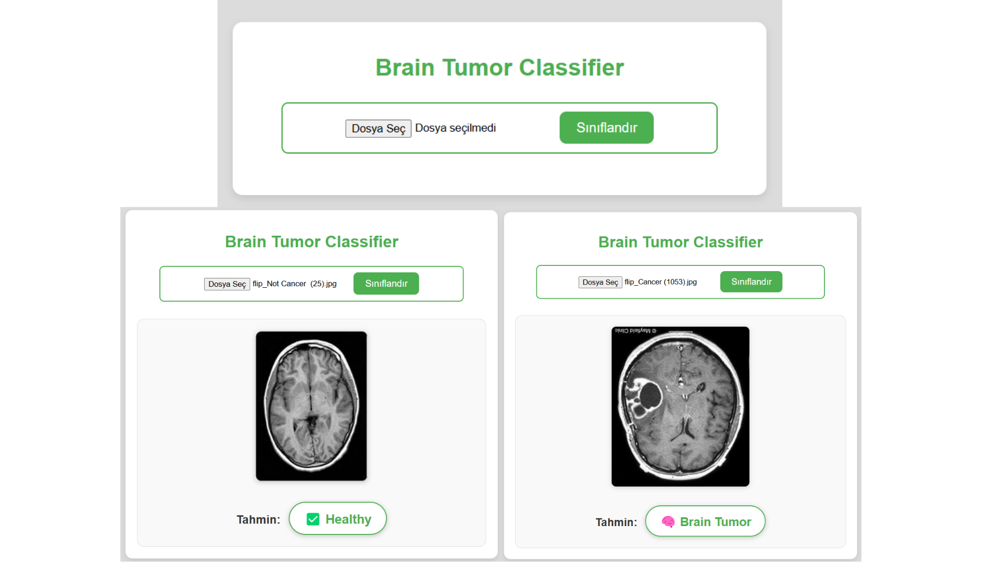
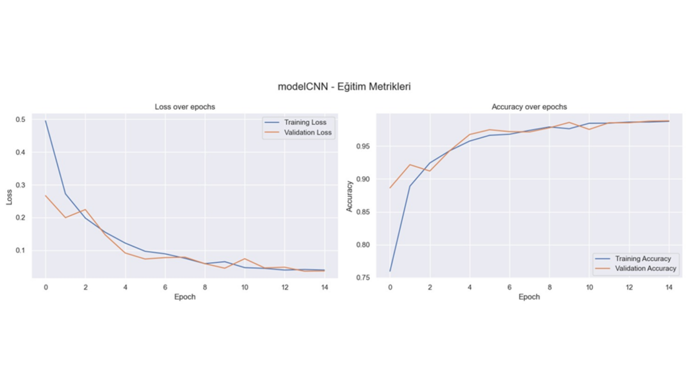
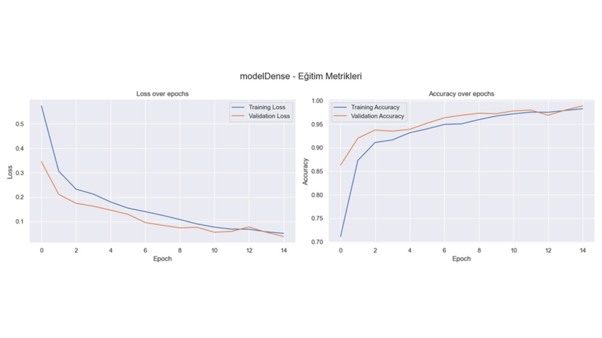
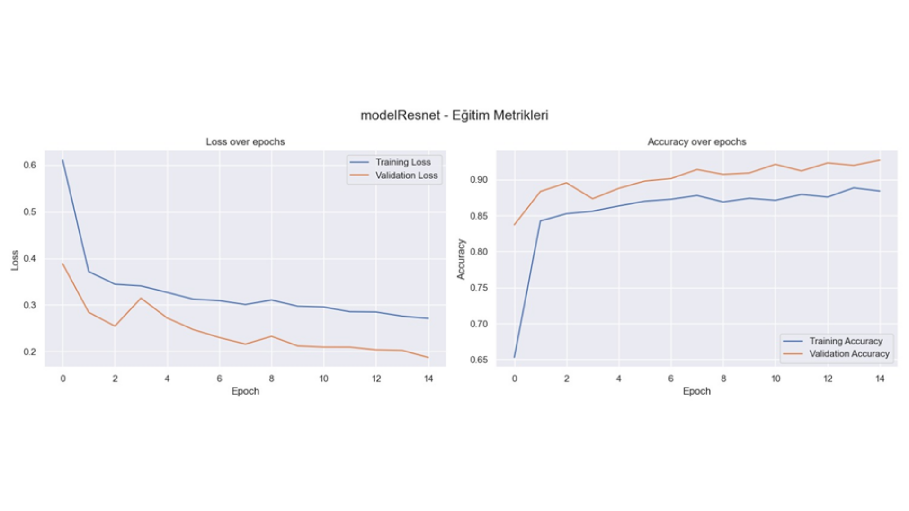

# 🧠 Beyin Tümörü Tespiti (Brain Tumor Detection) – Inception-ResNetV2, DenseNet169, CNN

Bu proje, **beyin MR görüntülerinden tümör teşhisi yapmak** amacıyla geliştirilmiştir. Çalışmada, modern derin öğrenme mimarileri (Inception-ResNetV2, DenseNet169) ile özelleştirilmiş bir Convolutional Neural Network (CNN) modeli karşılaştırılmıştır. Amaç, farklı derinlikteki mimarilerin sınıflandırma performanslarını incelemek ve beyin tümörü tanısında etkili bir yapay zeka tabanlı destek sistemi oluşturmaktır.

This project was developed to **detect brain tumors from MRI images**. In this study, modern deep learning architectures (Inception-ResNetV2, DenseNet169) were compared with a custom Convolutional Neural Network (CNN) model. The aim is to investigate the classification performance of architectures with different depths and to build an effective AI-based decision support system for brain tumor diagnosis.

---

## 📂 Veri Seti (Dataset)

📌 **Kullanılan veri seti:** Kaggle – Brain MRI Dataset  
🔗 [Brain MRI Dataset – Kaggle Link](https://www.kaggle.com/datasets/preetviradiya/brian-tumor-dataset/data?select=Brain+Tumor+Data+Set)

Veri seti, **iki sınıftan** oluşmaktadır:

- Brain Tumor (Tümör)
- Healthy (Sağlıklı)

The dataset consists of **two classes**:

- Brain Tumor
- Healthy

---

## ⚙️ Proje Metodolojisi (Project Methodology)

🔬 **1. Veri Setinin Bulunması (Finding the Dataset)**  
- Kaggle üzerinden **Brain MRI Dataset** bulundu ve indirildi.  
- Veri seti iki sınıf içeriyor: Tümörlü ve Sağlıklı.

🔬 **1. Finding the Dataset**  
- **Brain MRI Dataset** was found and downloaded from Kaggle.  
- The dataset contains two classes: Tumor and Healthy.

---

🔬 **2. Veri Arttırma İşlemleri (Data Augmentation)**  
- `torchvision.transforms` kullanılarak eğitim verisi üzerinde veri arttırma yapıldı.  
- Flip (yansıtma), rotation (döndürme) gibi yöntemler uygulandı. Bu sayede modelin farklı açılardaki verileri genellemesi sağlandı.

🔬 **2. Data Augmentation**  
- Data augmentation was applied on the training data using `torchvision.transforms`.  
- Methods like flip and rotation were used to help the model generalize to different orientations.

---

🔬 **3. Eğitim, Doğrulama ve Test Veri Setlerinin Oluşturulması (Creating Train, Validation, Test Sets)**  
- `split-folders` kütüphanesi ile veri seti **%70 eğitim, %15 doğrulama, %15 test** olacak şekilde bölündü.  
- Bu işlem eğitim performansını gerçekçi değerlendirmek için önemlidir.

🔬 **3. Creating Train, Validation, and Test Sets**  
- The dataset was split into **70% train, 20% validation, 10% test** using `split-folders`.  
- This is important for realistic evaluation of training performance.

---

🔬 **4. Transforms İşlemlerinin Uygulanması (Applying Transforms)**  
- `torchvision.transforms` ile tüm veri setine yeniden boyutlandırma (256x256), tensöre dönüştürme ve normalize işlemleri uygulandı.  
- Böylece modeller ImageNet ön eğitimli katmanlarla uyumlu girişler aldı.

🔬 **4. Applying Transforms**  
- Resizing (256x256), tensor conversion, and normalization were applied using `torchvision.transforms`.  
- This ensured compatibility with pretrained ImageNet layers.

---

🔬 **5. CNN Modelinin Oluşturulması (Creating the CNN Model)**  
- Başlangıç olarak **sıfırdan bir CNN modeli** oluşturuldu.  
- Conv2D, MaxPooling, Flatten ve Fully Connected katmanlar eklendi.  
- Dropout ile overfitting azaltıldı.

🔬 **5. Creating the CNN Model**  
- A **custom CNN model** was created from scratch as a baseline.  
- Conv2D, MaxPooling, Flatten, and Fully Connected layers were added.  
- Dropout was used to reduce overfitting.

---

🔬 **6. Karşılaştırılacak Modellerin Oluşturulması (Creating Comparative Models)**  
- **Transfer Learning** yöntemiyle Inception-ResNetV2 ve DenseNet169 modelleri import edildi.  
- Son katmanları çıkarılarak, ikili sınıflandırma için yeni fully connected katmanlar eklendi.  
- Tüm modeller PyTorch frameworkü ile eğitime hazırlandı.

🔬 **6. Creating Comparative Models**  
- Inception-ResNetV2 and DenseNet169 models were imported using **Transfer Learning**.  
- Their last layers were replaced with new fully connected layers for binary classification.  
- All models were prepared for training using PyTorch.

---

🔬 **7. Eğitim, Doğrulama ve Test İşlemlerinin Yapılması (Training, Validation, and Testing)**  
- Eğitimde **Adam optimizer**, **NLLLoss** ve **ReduceLROnPlateau scheduler** kullanıldı.  
- Her epoch sonrası doğrulama metrikleri hesaplandı.  
- En iyi model `.pth` formatında kaydedildi.  
- Test aşamasında Accuracy, Precision, Recall, F1-Score ve Confusion Matrix oluşturuldu.

🔬 **7. Training, Validation, and Testing**  
- **Adam optimizer**, **NLLLoss**, and **ReduceLROnPlateau scheduler** were used during training.  
- Validation metrics were calculated after each epoch.  
- The best model was saved in `.pth` format.  
- In testing phase, Accuracy, Precision, Recall, F1-Score, and Confusion Matrix were generated.

---

🔬 **8. Karmaşıklık Matrislerinin Gösterilmesi (Displaying Confusion Matrices)**  
- `seaborn` kullanılarak test seti için confusion matrix heatmap görselleştirildi.  
- Sağlıklı ve tümör sınıflarının karışım oranları net şekilde analiz edildi.

🔬 **8. Displaying Confusion Matrices**  
- Confusion matrix heatmap was visualized using `seaborn` for the test set.  
- The mix ratios of healthy and tumor classes were analyzed clearly.

---

🔬 **9. WEB Arayüzünün Oluşturulması (Creating the WEB Interface)**  
- Flask kullanılarak, eğitilen modellerin yüklenip tekil görüntüler üzerinde test edilebileceği bir arayüz planlandı.  
- Kullanıcı, yüklediği MRI görüntüsünün tümörlü olup olmadığını kolayca öğrenebilir.

🔬 **9. Creating the WEB Interface**  
- A web interface was planned using Flask or Streamlit, where trained models can be loaded and tested on single images.  
- Users can easily learn if their uploaded MRI image is tumorous or healthy.

---

## 🛠️ Kullanılan Kütüphaneler (Used Libraries)

| Kütüphane | Açıklama | Library | Description |
|---|---|---|---|
| **torch** | PyTorch derin öğrenme kütüphanesi | **torch** | PyTorch deep learning library |
| **torchvision** | Görüntü ön işleme ve veri setleri için | **torchvision** | For image preprocessing and datasets |
| **pretrainedmodels** | Inception-ResNetV2 gibi modelleri yüklemek için | **pretrainedmodels** | For loading models like Inception-ResNetV2 |
| **split-folders** | Veri setini train/val/test olarak ayırmak için | **split-folders** | To split dataset into train/val/test |
| **torch-summary** | Model katmanlarını özetlemek için | **torch-summary** | For summarizing model layers |
| **scikit-learn** | Metrikler ve confusion matrix için | **scikit-learn** | For metrics and confusion matrix |
| **matplotlib** | Grafik çizimi | **matplotlib** | For plotting graphs |
| **seaborn** | İleri seviye grafik çizimi (heatmap) | **seaborn** | For advanced plotting (heatmaps) |
| **PIL (Pillow)** | Görsel işleme | **PIL (Pillow)** | Image processing |

---

## 💾 Eğitilmiş Model Dosyaları (Trained Model Files)

| Dosya | Açıklama | File | Description |
|---|---|---|---|
| **modelCNN2.pth** | Özel CNN modelinin eğitilmiş ağırlıkları | **modelCNN2.pth** | Trained weights of the custom CNN model |

---

## 📊 Sonuçlar ve Confusion Matrix (Results & Confusion Matrix)

Model performansı **Accuracy, Precision, Recall, F1-Score** metrikleri ile değerlendirilmiştir. Ayrıca, confusion matrix heatmap olarak görselleştirilmiştir.

Model performance was evaluated using **Accuracy, Precision, Recall, and F1-Score** metrics. Confusion matrix was also visualized as a heatmap.

---

## 🚀 Kurulum ve Çalıştırma (Installation & Running)

1. **Gerekli kütüphaneleri yükleyin:**

```bash```
pip install torch torchvision pretrainedmodels split-folders torch-summary scikit-learn matplotlib seaborn pillow 

2. Arayüzü çalıştırmak için 

```bash```
python app.py

---

### 📊 Data Distribution



### 📊 Interface


### 📊 Data Distribution CNN



### 📊 Data Distribution DenseNET



### 📊 Data Distribution InceptionResnet



✨ Katkıda Bulunanlar (Contributors)

👩‍💻 Ceren ATICI – Model geliştirme, eğitim ve test

👩‍💻 Ceren ATICI – Model development, training and testing

📞 İletişim (Contact)

Her türlü soru ve öneriniz için GitHub üzerinden benimle iletişime geçebilirsiniz.

For any questions or suggestions, feel free to contact me via GitHub.
